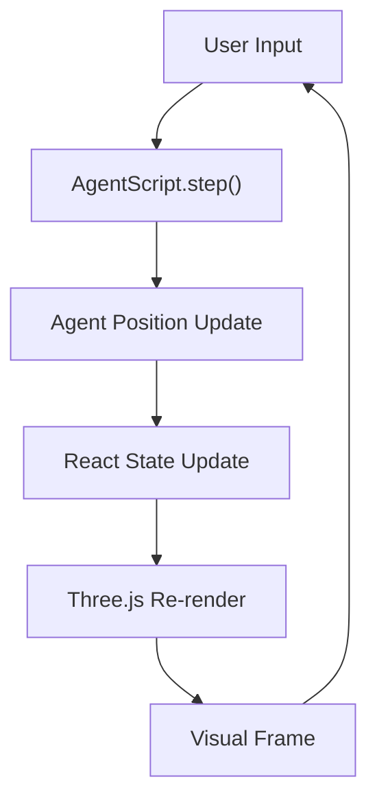

# React Three Fiber + AgentScript (ABM) Template

React Three Fiber (R3F) と AgentScript を使用して、ブラウザ上でエージェントベースモデリング (ABM) を構築・可視化するためのテンプレートプロジェクトです。避難シミュレーションをデモとして実装しています。

## 📋 概要

このプロジェクトは、3D空間で動作するエージェントベースモデル（ABM）を `React Three Fiber` で可視化するための基本的な構造を提供します。
デモとして、特定の環境からのエージェント避難シミュレーションが含まれています。このテンプレートをベースに、独自のエージェントモデルやインタラクションを構築することが可能です。

## 🛠 技術スタック

### フロントエンド
- **React 18** - ユーザーインターフェース
- **React Three Fiber** - Three.js の React ラッパー（3D レンダリング）
- **@react-three/drei** - R3F 用ヘルパーライブラリ
- **@react-three/postprocessing** - 視覚効果（Bloom エフェクト）
- **Leva** - リアルタイム GUI コントロール

### シミュレーション
- **AgentScript** - エージェントベースモデリングフレームワーク
- **Chroma.js** - カラーマネジメント

### 開発・ビルド
- **Vite** - 高速開発サーバー・ビルドツール
- **ESLint** - コード品質管理

## 🚀 セットアップ・実行

```bash
# 依存関係のインストール
npm install

# 開発サーバーの起動
npm run dev

# プロダクションビルド
npm run build

# コードチェック
npm run lint
```

## 🏗 アーキテクチャ

### システム構成

```
┌─────────────────┐    ┌──────────────────┐    ┌─────────────────┐
│   React UI      │───▶│ AgentScript      │───▶│ Three.js        │
│   (Leva GUI)    │    │ Simulation       │    │ 3D Rendering    │
└─────────────────┘    └──────────────────┘    └─────────────────┘
        │                       │                       │
        │                       │                       │
        ▼                       ▼                       ▼
┌─────────────────┐    ┌──────────────────┐    ┌─────────────────┐
│ User Controls   │    │ Agent Behaviors  │    │ Visual Output   │
│ - Start/Stop    │    │ - Pathfinding    │    │ - Agent Spheres │
│ - Reset         │    │ - Exit Selection │    │ - Environment   │
└─────────────────┘    └──────────────────┘    └─────────────────┘
```

### コンポーネント階層

```
App.jsx
├── Canvas (React Three Fiber)
    └── Scene.jsx
        ├── AgentSphere (エージェント描画)
        ├── PatchesSphere (環境描画)
        ├── OrbitControls (カメラ操作)
        ├── RandomizedLight (照明)
        └── Grid (グリッド表示)
```

## 🧮 シミュレーション原理

### エージェントベースモデル（ABM）

1. **パッチベース世界モデル**
   ```javascript
   // 環境の離散化表現
   0: inside  // 歩行可能エリア
   1: wall    // 通行不可（壁）
   2: exits   // 避難目標（出口）
   3: empty   // 外部空間
   ```

2. **エージェント行動ルール**
   ```javascript
   // 各ステップでの意思決定プロセス
   if (agent.location === 'inside') {
     // 1. 移動可能な隣接パッチを探索
     // 2. 目標出口に最も近いパッチを選択
     // 3. 現在位置より出口に近づける場合のみ移動
   } else {
     // 外部到達後は直進継続（避難完了）
   }
   ```

3. **距離ベース経路選択**
   - ユークリッド距離による最短経路探索
   - 局所的最適化（貪欲法）
   - 衝突回避（1パッチ1エージェント制約）

### 3D 可視化システム

#### インスタンスレンダリング
```javascript
// パフォーマンス最適化のための大量オブジェクト描画
<instancedMesh ref={meshRef} args={[geometry, material, agentCount]} />
```

#### 動的カラーリング
```javascript
// 出口IDに基づくエージェント色分け
const colors = {
  'E15:38': 0xff0000,  // 赤系出口
  'E37:20': 0x0000ff,  // 青系出口
  'E0:19':  0xffff00,  // 黄系出口
  'E34:0':  0x00ffff   // シアン系出口
}
```

## 📊 データフロー

### シミュレーションループ



### 状態管理

1. **AgentScript モデル** - シミュレーション状態
2. **React State** - UI 状態・エージェント位置
3. **Three.js Scene** - 3D オブジェクト状態

## 🎯 主要機能

### シミュレーション制御
- **Start**: 自動ステップ実行開始（110ms間隔）
- **Reset**: シミュレーション完全リセット

### 可視化機能
- エージェント位置のリアルタイム更新
- 出口別エージェント色分け
- 環境構造（壁・出口）の3D表示
- インタラクティブカメラ操作

### 分析機能
- エージェント密度の調整（population パラメータ）
- 複数レイアウトの切り替え対応
- パフォーマンス最適化された大規模シミュレーション

## 📈 パフォーマンス最適化

### レンダリング最適化
- **インスタンスレンダリング** - 同一ジオメトリの効率的描画
- **コードスプリッティング** - ライブラリ別チャンク分割
- **フレームレート制御** - 110ms 間隔のシミュレーション更新

### メモリ最適化
- ジオメトリ・マテリアルの再利用
- エージェント状態の差分更新
- 不要なオブジェクト参照の削除

## 🔧 開発・拡張

### 新規レイアウト追加
```javascript
// src/layout.js に新しい配列を追加
export const newLayout = [
  // グリッドデータ定義
]

// src/agentScript.js でレイアウト選択
const map = new DataSet(width, height, newLayout)
```

### エージェント行動カスタマイズ
```javascript
// ExitModel.step() メソッドを編集
// 新しい行動ルールを実装
```

### ビジュアル拡張
```javascript
// Scene.jsx でレンダリングコンポーネント追加
// 新しい視覚化要素の実装
```

## 📝 技術的制約・考慮事項

### シミュレーション精度
- 離散空間モデル（連続空間ではない）
- 局所最適化による経路選択（大域最適ではない）
- 単純化された人間行動モデル

### パフォーマンス制約
- ブラウザのJavaScript実行性能に依存
- WebGL対応デバイスが必要
- 大規模エージェント数での性能劣化可能性

### 拡張性
- AgentScript フレームワークの機能制約
- React Three Fiber のバージョン依存
- Three.js の機能制限

## 📚 参考文献・関連技術

- [AgentScript](https://github.com/backspaces/agentscript) - エージェントベースモデリング
- [React Three Fiber](https://docs.pmnd.rs/react-three-fiber) - React 3D レンダリング
- [Three.js](https://threejs.org/) - WebGL 3D ライブラリ
- [Crowd Simulation](https://en.wikipedia.org/wiki/Crowd_simulation) - 群衆シミュレーション理論

## 🤝 貢献・ライセンス

このプロジェクトは技術者・研究者向けの避難シミュレーション研究用途として開発されています。機能拡張や改良についてはプロジェクトメンテナーまでお問い合わせください。